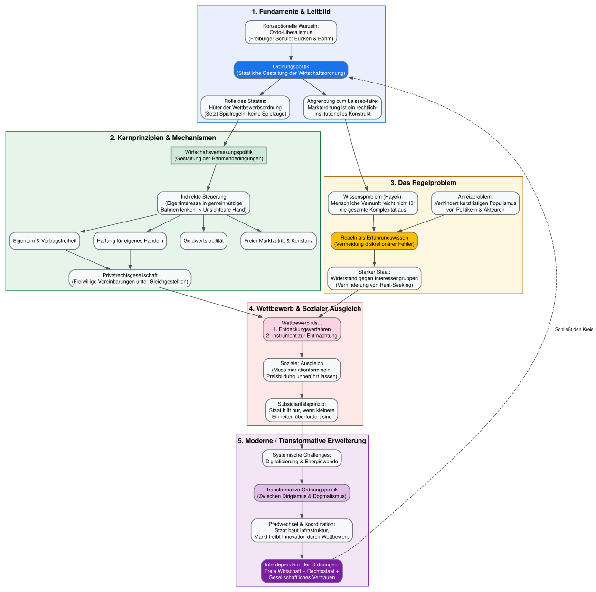
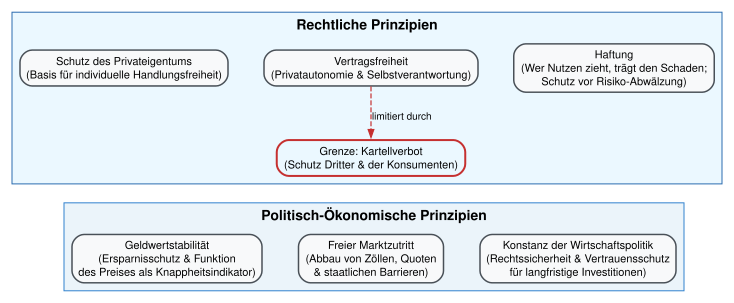

# Wirtschaftspolitik und Wirtschaftspsychologie in der 	&bdquo;grünen Transformation&ldquo;

## Einleitung 

### Welche Transformationsherausforderungen bestehen?

- Begrenzung der durchschnittlichen Erderwärmung, nach Möglichkeit auf unter 1,5 - 2°C

- Dekarbonisierung bis Mitte des 21 Jahrhunderts

- Energiewende: Weg von von fossilen Energieträgern hin zu erneuerbaren

- Dekarbonisierung des Verkehrs

- Dekarbonisierung der Gebäude

- Digitalisierung

- Hintergrundherausforderungen

   - Demografischer Wandel
   
   - Internationale Migration
   
   - Geopolitische Spannungen


### Welche wirtschaftspolitischen Herausforderungen sind damit verbunden?

- Anpassung der Infrastruktur (z.B. Stromerzeugung im Norden und Transport in den Süden)

- Sozialpolitische Flankierung

  - Private Nutzer nicht durch Innovationen "abhängen"
  
  - Beschäftigungsabbau/ - umbau in bestimmten Branchen sozial-  und arbeitsmarktpolitisch flankieren

- Konsumverhalten steuern; Vereinbarkeit mit gewinnmaximierenden Strategien

- Aufklärung/ Information

- Innovationspolitik

- $\dots$

### Welche Rolle spielen Erwartungen/Psychologie?

- Keine Ängste schüren - Herausforderungen konstruktiv begleiten

- Positive Erwartungen wecken/adressieren/bestärken

- Verlässlichkeit


### Aktuelle Debatte

[Vöpel (2025): Grundzüge einer transformativen Ordnungspolitik](https://www.cep.eu/fileadmin/user_upload/cep.eu/Studien/cepInput_Grundzuege_einer_transformativen_Ordnungspolitik/cepInput_Grundzuege_einer_transformativen_Ordnungspolitik.pdf)

```{r qr1,  echo=FALSE, warning=FALSE}

library(qrcode)

qr1 <- qr_code('https://www.cep.eu/fileadmin/user_upload/cep.eu/Studien/cepInput_Grundzuege_einer_transformativen_Ordnungspolitik/cepInput_Grundzuege_einer_transformativen_Ordnungspolitik.pdf')
#plot(qr)

generate_svg(qr1, filename = "qr-Voepel.svg")


```


{width="30%"}


## Industriepolitik

### Horizontale vs. vertikale Industriepolitik

#### Gegenüberstellung

```{r}
#| message: false
#| warning: false


library(knitr)

# Erstelle den Data Frame
industriepolitik <- data.frame(
  Merkmal = c(
    "Zielgruppe",
    "Ansatz",
    "Beispiele",
    "Vorteile",
    "Risiken",
    "Politische Akzeptanz"
  ),
  Horizontale_Industriepolitik = c(
    "Gesamte Wirtschaft/Industrie",
    "Allgemeine Rahmenbedingungen verbessern",
    "Infrastruktur, Bildung, Forschung, Steueranreize",
    "Wettbewerb bleibt erhalten, geringe Verzerrungen",
    "Weniger gezielte Steuerung, ggf. langsamer Wandel",
    "Breiter Konsens, marktkonform"
  ),
  Vertikale_Industriepolitik = c(
    "Einzelne Sektoren, Branchen oder Unternehmen",
    "Selektive Förderung strategischer Bereiche",
    "Subventionen für Batterien, Stahl, E-Mobilität",
    "Schnelle Entwicklung strategischer Industrien",
    "Wettbewerbsverzerrung, Risiko von Fehlallokation",
    "Umstritten, Gefahr von Lobbyismus"
  )
)

# Gib die Tabelle mit kable aus
kable(industriepolitik, 
      col.names = c("Merkmal", "Horizontale Industriepolitik", "Vertikale Industriepolitik"),
      caption = "Vergleich: Horizontale vs. vertikale Industriepolitik")

```

#### Aktuelle Debatte

[Kranen/Freitag (2024): STEP – ein Paradigmenwechsel in der europäischen Wirtschaftspolitik?](https://www.wirtschaftsdienst.eu/inhalt/jahr/2024/heft/12/beitrag/step-ein-paradigmenwechsel-in-der-europaeischen-wirtschaftspolitik.html)

```{r qr,  echo=FALSE, warning=FALSE}
library(qrcode)

qr <- qr_code('https://www.wirtschaftsdienst.eu/inhalt/jahr/2024/heft/12/beitrag/step-ein-paradigmenwechsel-in-der-europaeischen-wirtschaftspolitik.html')
#plot(qr)

generate_svg(qr, filename = "qr-STEP.svg")

```

{width="30%"}

### Industriepolitik in der Transformation

## Ordnungspolitik

### Grundsätzliches

- Soziale Phänomene:
  - Ergebnisse menschlichen Handelns, aber nicht menschlichen Entwurfs
- Wie können Menschen in einer Gesellschaft ihr Wissen bestmöglich einsetzen und ihre Pläne verwirklichen?
- Schaffung eines geeigneten Ordnungsrahmens:
  - Belohnungen für Entdeckung und Umsetzung von Problemlösungen
  - Wettbewerb als Entdeckungsverfahren (vgl. Hayek)
  - Stabilität durch Flexibilität

---

- Zivilisatorische Errungenschaft:
  - Ein Ordnungsrahmen, in dem jeder unendlich viel mehr Wissen nutzen kann, als er oder sie selbst je hat
    - Nutzung von Gütern, die man nicht selbst herstellen kann
    - Produktion von Gütern: *Niemand auf der Welt kann einen Bleistift herstellen!* (Leonard Read)
    - Nutzung eines Ordnungsrahmens, der selbst nicht verstanden wird
- Rolle der Politik: Ordnungsrahmen schaffen und erhalten
- Fördert oder hemmt „Wirtschaftspolitik“ durch Eingriffe in ökonomische Prozesse diesen Ordnungsrahmen?

---

- Konstituierende Prinzipien der Wettbewerbsordnung nach W. Eucken:
  - Stabile Geldpolitik
  - Offene Märkte
  - Privateigentum
  - Vertragsfreiheit
  - Haftung
  - Konstanz der Wirtschaftspolitik

---

- Wozu Prinzipien?
  - Verpflichtung auf langfristige Interessen der Bürger
  - Berechenbarkeit der Politik
  - Bewährte Regeln für Situationen der Unsicherheit
  - Schutz vor Druck in Richtung Opportunismus

---

```{python}
#| message: false
#| warning: false
#| output: false

import graphviz
# from IPython.display import display

# Graph-Initialisierung mit modernem, klarem Design
dot = graphviz.Digraph('Ordnungspolitik', comment='Struktur der Ordnungspolitik')
dot.attr(rankdir='TB', # splines='ortho',
nodesep='0.4', rankingsep='0.5')

# Globale Node- und Edge-Styles für bessere Lesbarkeit
dot.attr('node', fontname='Helvetica,Arial,sans-serif', fontsize='11', shape='box',
         style='filled,rounded', fillcolor='#F8F9FA', color='#6C757D', penwidth='1.5')
dot.attr('edge', fontname='Helvetica,Arial,sans-serif', fontsize='10', color='#495057',
         arrowsize='0.8', penwidth='1.2')

# --------------------------------------------------------
# CLUSTER 1: Fundamente & Leitbild
# --------------------------------------------------------
with dot.subgraph(name='cluster_0') as c:
    c.attr(label='1. Fundamente & Leitbild', bgcolor='#E8F0FE', color='#1A73E8', fontname='Helvetica-Bold')

    c.node('OP', 'Ordnungspolitik\n(Staatliche Gestaltung der Wirtschaftsordnung)', fillcolor='#1A73E8', fontcolor='white')
    c.node('Wurzeln', 'Konzeptionelle Wurzeln:\nOrdo-Liberalismus\n(Freiburger Schule: Eucken & Böhm)')
    c.node('Abgrenzung', 'Abgrenzung zum Laissez-faire:\nMarktordnung ist ein rechtlich-\ninstitutionelles Konstrukt')
    c.node('RolleStaat', 'Rolle des Staates:\nHüter der Wettbewerbsordnung\n(Setzt Spielregeln, keine Spielzüge)')

    c.edge('Wurzeln', 'OP')
    c.edge('OP', 'Abgrenzung')
    c.edge('OP', 'RolleStaat')

# --------------------------------------------------------
# CLUSTER 2: Prinzipien & Steuerung
# --------------------------------------------------------
with dot.subgraph(name='cluster_1') as c:
    c.attr(label='2. Kernprinzipien & Mechanismen', bgcolor='#E6F4EA', color='#137333', fontname='Helvetica-Bold')

    c.node('Wirtschaftsverfassung', 'Wirtschaftsverfassungspolitik\n(Gestaltung der Rahmenbedingungen)', style='filled,bold', fillcolor='#CEEAD6')
    c.node('Indirekt', 'Indirekte Steuerung\n(Eigeninteresse in gemeinnützige\nBahnen lenken -> Unsichtbare Hand)')

    # Konstituierende Prinzipien
    c.node('P1', 'Eigentum & Vertragsfreiheit')
    c.node('P2', 'Haftung für eigenes Handeln')
    c.node('P3', 'Geldwertstabilität')
    c.node('P4', 'Freier Marktzutritt & Konstanz')

    c.node('Privatrecht', 'Privatrechtsgesellschaft\n(Freiwillige Vereinbarungen unter Gleichgestellten)')

    c.edge('Wirtschaftsverfassung', 'Indirekt')
    c.edge('Indirekt', 'P1')
    c.edge('Indirekt', 'P2')
    c.edge('Indirekt', 'P3')
    c.edge('Indirekt', 'P4')
    c.edge('P1', 'Privatrecht')
    c.edge('P2', 'Privatrecht')

# Verbindung von Block 1 zu Block 2
dot.edge('RolleStaat', 'Wirtschaftsverfassung', ltail='cluster_0', lhead='cluster_1')

# --------------------------------------------------------
# CLUSTER 3: Das Regelproblem (Warum Regeln?)
# --------------------------------------------------------
with dot.subgraph(name='cluster_2') as c:
    c.attr(label='3. Das Regelproblem', bgcolor='#FEF7E0', color='#B06000', fontname='Helvetica-Bold')

    c.node('Wissensproblem', 'Wissensproblem (Hayek):\nMenschliche Vernunft reicht nicht für\ndie gesamte Komplexität aus')
    c.node('Anreizproblem', 'Anreizproblem:\nVerhindert kurzfristigen Populismus\nvon Politikern & Akteuren')
    c.node('Regeln', 'Regeln als Erfahrungswissen\n(Vermeidung diskretionärer Fehler)', fillcolor='#FBBC04', style='filled,rounded')
    c.node('StarkerStaat', 'Starker Staat:\nWiderstand gegen Interessengruppen\n(Verhinderung von Rent-Seeking)')

    c.edge('Wissensproblem', 'Regeln')
    c.edge('Anreizproblem', 'Regeln')
    c.edge('Regeln', 'StarkerStaat')

dot.edge('Abgrenzung', 'Wissensproblem')

# --------------------------------------------------------
# CLUSTER 4: Wettbewerb & Soziale Marktwirtschaft
# --------------------------------------------------------
with dot.subgraph(name='cluster_3') as c:
    c.attr(label='4. Wettbewerb & Sozialer Ausgleich', bgcolor='#FCE8E6', color='#C5221F', fontname='Helvetica-Bold')

    c.node('Wettbewerb', 'Wettbewerb als...\n1. Entdeckungsverfahren\n2. Instrument zur Entmachtung', fillcolor='#FAD2E1')
    c.node('SozialerAusgleich', 'Sozialer Ausgleich\n(Muss marktkonform sein,\nPreisbildung unberührt lassen)')
    c.node('Subsidiaritaet', 'Subsidiaritätsprinzip:\nStaat hilft nur, wenn kleinere\nEinheiten überfordert sind')

    c.edge('Wettbewerb', 'SozialerAusgleich')
    c.edge('SozialerAusgleich', 'Subsidiaritaet')

dot.edge('Privatrecht', 'Wettbewerb')
dot.edge('StarkerStaat', 'Wettbewerb')

# --------------------------------------------------------
# CLUSTER 5: Transformative Ordnungspolitik
# --------------------------------------------------------
with dot.subgraph(name='cluster_4') as c:
    c.attr(label='5. Moderne / Transformative Erweiterung', bgcolor='#F3E5F5', color='#7B1FA2', fontname='Helvetica-Bold')

    c.node('TransOP', 'Transformative Ordnungspolitik\n(Zwischen Dirigismus & Dogmatismus)', fillcolor='#E1BEE7')
    c.node('Herausforderungen', 'Systemische Challenges:\nDigitalisierung & Energiewende')
    c.node('Pfadwechsel', 'Pfadwechsel & Koordination:\nStaat baut Infrastruktur,\nMarkt treibt Innovation durch Wettbewerb')
    c.node('Interdependenz', 'Interdependenz der Ordnungen:\nFreie Wirtschaft + Rechtsstaat +\nGesellschaftliches Vertrauen', fillcolor='#7B1FA2', fontcolor='white')

    c.edge('Herausforderungen', 'TransOP')
    c.edge('TransOP', 'Pfadwechsel')
    c.edge('Pfadwechsel', 'Interdependenz')

# Verbindungen zur Transformation
dot.edge('Subsidiaritaet', 'Herausforderungen')
dot.edge('Interdependenz', 'OP', style='dashed', constraint='false', label=' Schließt den Kreis')

# Graph im Jupyter Notebook anzeigen
# display(dot)

dot.render('Ordnungspolitik', format='svg', cleanup=True)
```



```{python}
#| message: false
#| warning: false
#| output: false


import graphviz
# from IPython.display import display

# Erstellung des Hauptgraphen mit optimiertem Layout für hierarchische Strukturen
dot = graphviz.Digraph('Wettbewerbsordnung', comment='Konstituierende Prinzipien der Wettbewerbsordnung')
dot.attr(rankdir='TB', nodesep='0.5', rankingsep='0.6')

# Globale Stildefinitionen (Clean & Professional)
dot.attr('node', fontname='Helvetica,Arial,sans-serif', fontsize='11', shape='box',
         style='filled,rounded', fillcolor='#F8F9FA', color='#495057', penwidth='1.5')
dot.attr('edge', fontname='Helvetica,Arial,sans-serif', fontsize='10', color='#6C757D',
         arrowsize='0.8', penwidth='1.2')

# ========================================================
# CLUSTER 1: Das Fundament (Freiburger Schule)
# ========================================================
#with dot.subgraph(name='cluster_basis') as c:
#    c.attr(label='1. Theoretisches Fundament (1930er)', bgcolor='#EDF2F7', color='#4A5568', fontname='Helvetica-Bold')
    #
#    c.node('FS', 'Freiburger Schule\n(Eucken, Böhm, Großmann-Doerth)', fillcolor='#4A5568', fontcolor='white')
#    c.node('Leitbild', 'Oberstes Ziel:\nFunktionsfähige & menschenwürdige\nWirtschaftsordnung\n(Vollständiger Wettbewerb & Preissystem)')
#    c.node('StaatHüter', 'Der Staat als Hüter:\nSteht über den Einzelinteressen;\nresistenter Rahmen gegen Machtgruppen')

 #   c.edge('FS', 'Leitbild')
 #   c.edge('Leitbild', 'StaatHüter')

# ========================================================
# CLUSTER 2: Die Konstituierenden Prinzipien (Säulen)
# ========================================================
# Unterordner für Rechtliche Prinzipien
with dot.subgraph(name='cluster_recht') as c:
    c.attr(label='Rechtliche Prinzipien', bgcolor='#EBF8FF', color='#2B6CB0', fontname='Helvetica-Bold')

    c.node('Eigentum', 'Schutz des Privateigentums\n(Basis für individuelle Handlungsfreiheit)')
    c.node('Vertrag', 'Vertragsfreiheit\n(Privatautonomie & Selbstverantwortung)')
    c.node('Kartellverbot', 'Grenze: Kartellverbot\n(Schutz Dritter & der Konsumenten)', fillcolor='#EBF8FF', color='#C53030', penwidth='2.0')
    c.node('Haftung', 'Haftung\n(Wer Nutzen zieht, trägt den Schaden;\nSchutz vor Risiko-Abwälzung)')

    c.edge('Vertrag', 'Kartellverbot', label=' limitiert durch', color='#C53030', style='dashed')

# Unterordner für Ökonomisch-Politische Prinzipien
with dot.subgraph(name='cluster_oekonomisch') as c:
    c.attr(label='Politisch-Ökonomische Prinzipien', bgcolor='#EBF4FA', color='#3182CE', fontname='Helvetica-Bold')

    c.node('Geldwert', 'Geldwertstabilität\n(Ersparnisschutz & Funktion\ndes Preises als Knappheitsindikator)')
    c.node('Marktzutritt', 'Freier Marktzutritt\n(Abbau von Zöllen, Quoten\n& staatlichen Barrieren)')
    c.node('Konstanz', 'Konstanz der Wirtschaftspolitik\n(Rechtssicherheit & Vertrauensschutz\nfür langfristige Investitionen)')

# Verbindungen vom Fundament zu den Säulen
# dot.edge('Leitbild', 'Eigentum', ltail='cluster_basis')
# dot.edge('Leitbild', 'Geldwert', ltail='cluster_basis')

# Invisible edge to enforce vertical order between the two active clusters
dot.edge('Kartellverbot', 'Marktzutritt', style='invis')

# ========================================================
# CLUSTER 3: Dynamik & Marktwirkung
# ========================================================
# with dot.subgraph(name='cluster_dynamik') as c:
 #   c.attr(label='3. Dynamik des Leistungswettbewerbs', bgcolor='#FEF3C7', color='#D97706', fontname='Helvetica-Bold')

#    c.node('Leistungswettbewerb', 'Leistungswettbewerb\n(Erfolg nur durch die beste\nVersorgung der Konsumenten)')
#    c.node('Entdeckungsverfahren', 'Wettbewerb als Entdeckungsverfahren\n(Ermittlung von Knappheiten, Werten\n& neuen innovativen Verfahren)')
#    c.node('Interdependenz', 'Interdependenz der Ordnungen\n(Enge Wechselwirkung & gegenseitige\nBedingung aller Prinzipien)', fillcolor='#D97706', fontcolor='white')

 #   c.edge('Leistungswettbewerb', 'Entdeckungsverfahren')
 #   c.edge('Entdeckungsverfahren', 'Interdependenz')

# Brücke von den Säulen zur Dynamik
#dot.edge('Haftung', 'Leistungswettbewerb', ltail='cluster_recht', lhead='cluster_dynamik')
#dot.edge('Marktzutritt', 'Leistungswettbewerb', ltail='cluster_oekonomisch', lhead='cluster_dynamik')

# ========================================================
# CLUSTER 4: Transformative Erweiterung (Moderne)
# ========================================================
#with dot.subgraph(name='cluster_transform') as c:
#    c.attr(label='4. Transformative Erweiterung (Moderne Dimension)', bgcolor='#F3E8FF', color='#6B21A8', fontname='Helvetica-Bold')

#    c.node('TransAnforderungen', 'Systemische Challenges:\nDigitalisierung & Klimawandel\n(Erweiterung um Ganzheitlichkeit & Nachhaltigkeit)')
#    c.node('Balance', 'Austarierung der Regulierung:\nIncentivierung neuer Techs\nvs. Schutz des bestehenden Kapitalstocks')
#    c.node('Konsens', 'Soziokulturelles Fundament:\nInstitutionelles Vertrauen &
# gesellschaftlicher Konsens (Fairness)', fillcolor='#6B21A8', fontcolor='white')

#    c.edge('TransAnforderungen', 'Balance')
#    c.edge('Balance', 'Konsens')

# Verbindung von der klassischen Dynamik zur modernen Transformation
# dot.edge('Interdependenz', 'TransAnforderungen', label=' Weiterentwicklung', style='bold')
# dot.edge('Konsens', 'StaatHüter', style='dashed', label=' Stabilisiert Institutionen', constraint='false')

# Diagramm im Jupyter Notebook darstellen
# display(dot)

dot.render('Prinzipien', format='svg', cleanup=True)

```



### Und was heißt das für die Transformation?


## Sozialpolitik

## Psychologie der Transformation

### Einleitung

- Die Transformation verlangt eine simultane Neuorientierung auf vielen Feldern Gleichzeitig

- Dies ist eine komplexe Aufgabe, für die es in privaten Entscheidungen, in Unternehmen und in der Politik keine erprobten Routinen gibt

- Es ist naheliegend, dass wirtschaftspsychologische/verhaltensökonomische Effekte hier eine Rolle spielen

### Einige Grundkonzepte

#### Mental Accounting

- Wirkung von Preissignalen?

- Neuausrichtung der "Accounts" nötig (mehr fixe, höhere variable Ausgaben)

- $\dots$

#### Denken in Wahrscheinlichkeiten

- Auswirkungen auf die Transformation?

#### Asymmetrische Berücksichtigung von Gewinnen und Verlusten

- Auswirkungen auf die Transformation?

#### Status quo Bias

- Auswirkungen auf die Transformation?

#### Expressives Wählerverhalten

- Auswirkungen auf die Transformation?

### Werden Erkenntnisse der Wirtschaftspsychologie/Verhaltensökonomik auch umgesetzt?

#### Literatur

@urios_behavioural_2022 untersuchen genau diese Frage

```{r qr-behavioral,  echo=FALSE, warning=FALSE}
library(qrcode)

qr <- qr_code('https://sharedgreendeal.eu/resources/behavioural-cultural-and-social-issues-eu-green-deal-policy-documents')
#plot(qr)

generate_svg(qr, filename = "qr-behavioral-green-deal.svg")

```

{width="50%"}

#### Strukturierende Fragen

1. Was ist der European New Green Deal?
  
  - Ziel: Klimaneutralität
  
  - Strategie für Wachstum und Prosperität

2. Was sind verhaltensbezogene, soziale und kulturelle (BSC) Themen im Kontext des EU Green Deal?

  - Betroffenheit unterschiedlicher Einkommensgruppen
  
  - Berücksichtigung kultureller Prägungen
  
  - Berücksichtigung verhaltensökonomischer Aspekte

3. Warum sind sie wichtig?

  - Umfassende Transformation der Gesellschaft/Wirtschaft
  
  - Berücksichtigung kultureller Vorprägungen bestimmt bedeutsam
  
  - Kein Ausspielen Klima vs. soziale Gerechtigkeit

4. Inwieweit berücksichtigen die EU-Politikdokumente zu Green Deal-Themen BSC-Aspekte?

  - Gemischte Bilanz. Bei einigen Themen stärkere Berücksichtigung als bei anderen
  
  - Tendenziell ausführlichere Berücksichtigung in Mitteilungen als in Folgenabschätzungen
  