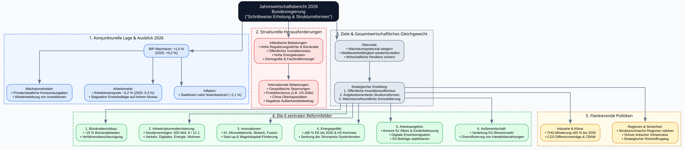
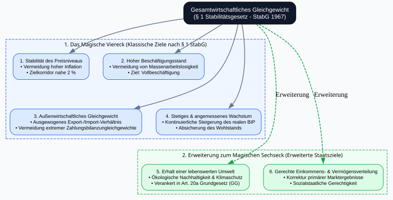
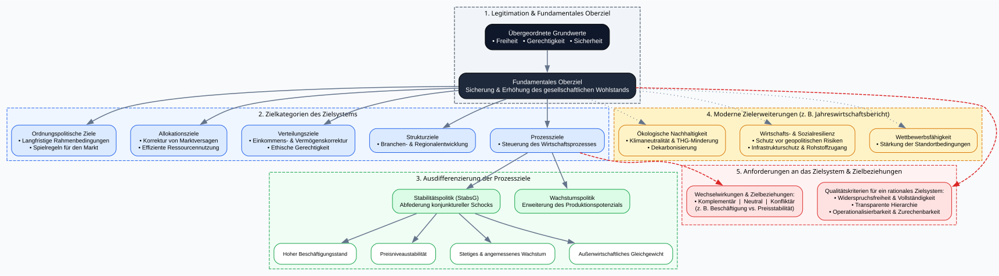

# Gegenstand der Wirtschaftspolitik

## Was sagt die Bundesregierung?

```{python}
#| output: false

import graphviz
from IPython.display import display

# Erstellung des gerichteten Graphviz-Diagramms
dot = graphviz.Digraph(
    'Jahreswirtschaftsbericht_2026',
    comment='Übersicht Jahreswirtschaftsbericht 2026',
    format='svg'
)

# Globale Layout-Einstellungen
dot.attr(
    rankdir='TB',
   splines='ortho',
    nodesep='0.5',
    ranksep='0.7',
    fontname='Arial',
    fontsize='12',
    bgcolor='#F8FAFC'
)

# Standard-Node-Styling
dot.attr('node', shape='rect', style='filled,rounded', fontname='Arial', fontsize='10', margin='0.2,0.1')
dot.attr('edge', color='#64748B', penwidth='1.5')

# Hauptknoten (Titel)
dot.node(
    'root',
    'Jahreswirtschaftsbericht 2026\nBundesregierung\n("Schrittweise Erholung & Strukturreformen")',
    fillcolor='#0F172A',
    fontcolor='#FFFFFF',
    fontsize='13',
    style='filled,rounded'
)

# --- 1. Konjunkturelle Lage ---
with dot.subgraph(name='cluster_konjunktur') as c:
    c.attr(label='1. Konjunkturelle Lage & Ausblick 2026', style='filled,dashed', fillcolor='#EFF6FF', color='#2563EB', fontname='Arial-Bold')
    c.node('bip', 'BIP-Wachstum: +1,0 %\n(2025: +0,2 %)', fillcolor='#DBEAFE', color='#2563EB')
    c.node('treiber', 'Wachstumstreiber:\n• Private/staatliche Konsumausgaben\n• Wiederbelebung von Investitionen', fillcolor='#DBEAFE', color='#2563EB')
    c.node('arbeitsmarkt', 'Arbeitsmarkt:\n• Arbeitslosenquote ~6,2 % (2025: 6,3 %)\n• Stagnation Erwerbstätige auf hohem Niveau', fillcolor='#DBEAFE', color='#2563EB')
    c.node('inflation', 'Inflation:\n• Stabilisiert nahe Notenbankziel (~2,1 %)', fillcolor='#DBEAFE', color='#2563EB')

# --- 2. Strukturelle Herausforderungen ---
with dot.subgraph(name='cluster_herausforderungen') as c:
    c.attr(label='2. Strukturelle Herausforderungen', style='filled,dashed', fillcolor='#FEF2F2', color='#DC2626', fontname='Arial-Bold')
    c.node('inland', 'Inländische Belastungen:\n• Hohe Regulierungsdichte & Bürokratie\n• Öffentlicher Investitionsstau\n• Hohe Energiekosten\n• Demografie & Fachkräftemangel', fillcolor='#FEE2E2', color='#DC2626')
    c.node('aussen', 'Internationale Belastungen:\n• Geopolitische Spannungen\n• Protektionismus (z.B. US-Zölle)\n• China-Überkapazitäten\n• Negativer Außenhandelsbeitrag', fillcolor='#FEE2E2', color='#DC2626')

# --- 3. Strategische Ziele & Dreiklang ---
with dot.subgraph(name='cluster_strategie') as c:
    c.attr(label='3. Ziele & Gesamtwirtschaftliches Gleichgewicht', style='filled,dashed', fillcolor='#F1F5F9', color='#475569', fontname='Arial-Bold')
    c.node('ziele', 'Oberziele:\n• Wachstumspotenzial steigern\n• Wettbewerbsfähigkeit wiederherstellen\n• Wirtschaftliche Resilienz sichern', fillcolor='#E2E8F0', color='#475569')
    c.node('dreiklang', 'Strategischer Dreiklang:\n1. Öffentliche Investitionsoffensive\n2. Angebotsorientierte Strukturreformen\n3. Wachstumsfreundliche Konsolidierung', fillcolor='#E2E8F0', color='#475569')

# --- 4. Die 6 Reformfelder ---
with dot.subgraph(name='cluster_reformen') as c:
    c.attr(label='4. Die 6 zentralen Reformfelder', style='filled,dashed', fillcolor='#F0FDF4', color='#16A34A', fontname='Arial-Bold')
    c.node('r1', '1. Bürokratierückbau:\n• -25 % Bürokratielasten\n• Verfahrensbeschleunigung', fillcolor='#DCFCE7', color='#16A34A')
    c.node('r2', '2. Infrastrukturmodernisierung:\n• Sondervermögen: 500 Mrd. € / 12 J.\n• Verkehr, Digitales, Energie, Wohnen', fillcolor='#DCFCE7', color='#16A34A')
    c.node('r3', '3. Innovationen:\n• KI, Microelektronik, Biotech, Fusion\n• Start-up & Wagniskapital-Förderung', fillcolor='#DCFCE7', color='#16A34A')
    c.node('r4', '4. Energiepolitik:\n• ≥80 % EE bis 2030 & H2-Kernnetz\n• Senkung der Strompreis-Systemkosten', fillcolor='#DCFCE7', color='#16A34A')
    c.node('r5', '5. Arbeitsangebot:\n• Anreize für Ältere & Kinderbetreuung\n• Digitale Erwerbsmigration\n• SV-Beiträge stabilisieren', fillcolor='#DCFCE7', color='#16A34A')
    c.node('r6', '6. Außenwirtschaft:\n• Vertiefung EU-Binnenmarkt\n• Diversifizierung von Handelsbeziehungen', fillcolor='#DCFCE7', color='#16A34A')

# --- 5. Flankierende Politiken ---
with dot.subgraph(name='cluster_flankierend') as c:
    c.attr(label='5. Flankierende Politiken', style='filled,dashed', fillcolor='#FFFBEB', color='#D97706', fontname='Arial-Bold')
    c.node('klima', 'Industrie & Klima:\n• THG-Minderung ≥65 % bis 2030\n• CO2-Differenzverträge & CBAM', fillcolor='#FEF3C7', color='#D97706')
    c.node('sicherheit', 'Regionen & Sicherheit:\n• Strukturschwache Regionen stärken\n• Schutz kritischer Infrastruktur\n• Strategischer Rohstoffzugang', fillcolor='#FEF3C7', color='#D97706')

# --- KANTEN / VERBINDUNGEN ---
# Root Verbindungen
dot.edge('root', 'bip')
dot.edge('root', 'inland')
dot.edge('root', 'ziele')

# Konjunktur Verbindungen
dot.edge('bip', 'treiber')
dot.edge('bip', 'arbeitsmarkt')
dot.edge('bip', 'inflation')

# Herausforderungen Verbindungen
dot.edge('inland', 'aussen')

# Strategie zu Reformfeldern
dot.edge('ziele', 'dreiklang')
dot.edge('dreiklang', 'r1')
dot.edge('dreiklang', 'r2')
dot.edge('dreiklang', 'r3')
dot.edge('dreiklang', 'r4')
dot.edge('dreiklang', 'r5')
dot.edge('dreiklang', 'r6')

# Verbindungen zu flankierenden Maßnahmen
dot.edge('dreiklang', 'klima')
dot.edge('dreiklang', 'sicherheit')

# Grafik im Arbeitsverzeichnis als SVG speichern
dot.render('jahreswirtschaftsbericht_2026', format='svg', cleanup=True)

# Ausgabe direkt im Jupyter/IPython Notebook
#display(dot)
```


## Was sagt das deutsche Recht?

```{python}
#| output: false

import graphviz
# from IPython.display import display

# Erstellung des gerichteten Graphviz-Diagramms
dot = graphviz.Digraph(
    'magisches_sechseck',
    comment='Wirtschaftspolitische Ziele in Deutschland - Magisches Viereck und Sechseck',
    format='svg'
)

# Globale Layout-Einstellungen
dot.attr(
    rankdir='TB',
    nodesep='0.4',
    ranksep='0.6',
    fontname='Arial',
    fontsize='11',
    bgcolor='#F8FAFC'
)

# Standard-Styling für Knoten und Kanten
dot.attr('node', shape='rect', style='filled,rounded', fontname='Arial', fontsize='10', margin='0.2,0.12')
dot.attr('edge', color='#64748B', penwidth='1.5')

# Oberziel: Gesamtwirtschaftliches Gleichgewicht
dot.node(
    'oberziel',
    'Gesamtwirtschaftliches Gleichgewicht\n(§ 1 Stabilitätsgesetz - StabG 1967)',
    fillcolor='#0F172A',
    fontcolor='#FFFFFF',
    fontsize='12',
    style='filled,rounded'
)

# --- 1. DAS MAGISCHE VIERECK (Klassische Ziele nach § 1 StabG) ---
with dot.subgraph(name='cluster_viereck') as c:
    c.attr(
        label='1. Das Magische Viereck (Klassische Ziele nach § 1 StabG)',
        style='filled,dashed',
        fillcolor='#EFF6FF',
        color='#2563EB',
        fontname='Arial-Bold'
    )

    c.node('z1', '1. Stabilität des Preisniveaus\n• Vermeidung hoher Inflation\n• Zielkorridor nahe 2 %', fillcolor='#DBEAFE', color='#2563EB')
    c.node('z2', '2. Hoher Beschäftigungsstand\n• Vermeidung von Massenarbeitslosigkeit\n• Ziel: Vollbeschäftigung', fillcolor='#DBEAFE', color='#2563EB')
    c.node('z3', '3. Außenwirtschaftliches Gleichgewicht\n• Ausgewogenes Export-/Import-Verhältnis\n• Vermeidung extremer Zahlungsbilanzungleichgewichte', fillcolor='#DBEAFE', color='#2563EB')
    c.node('z4', '4. Stetiges & angemessenes Wachstum\n• Kontinuierliche Steigerung des realen BIP\n• Absicherung des Wohlstands', fillcolor='#DBEAFE', color='#2563EB')

    # Anordnung der 4 Ziele in einem 2x2 Viereck
    with c.subgraph() as row1:
        row1.attr(rank='same')
        row1.node('z1'); row1.node('z2')
    with c.subgraph() as row2:
        row2.attr(rank='same')
        row2.node('z3'); row2.node('z4')

    # Unsichtbare Kanten, um die Viereck-Form zu erzwingen und die Spalten zu erhalten
    c.edge('z1', 'z3', style='invis')
    c.edge('z2', 'z4', style='invis')

# --- 2. ERWEITERUNG ZUM MAGISCHEN SECHSECK (Moderne Staatsziele) ---
with dot.subgraph(name='cluster_sechseck') as c:
    c.attr(
        label='2. Erweiterung zum Magischen Sechseck (Erweiterte Staatsziele)',
        style='filled,dashed',
        fillcolor='#F0FDF4',
        color='#16A34A',
        fontname='Arial-Bold'
    )

    c.node('z5', '5. Erhalt einer lebenswerten Umwelt\n• Ökologische Nachhaltigkeit & Klimaschutz\n• Verankert in Art. 20a Grundgesetz (GG)', fillcolor='#DCFCE7', color='#16A34A')
    c.node('z6', '6. Gerechte Einkommens- & Vermögensverteilung\n• Korrektur primärer Marktergebnisse\n• Sozialstaatliche Gerechtigkeit', fillcolor='#DCFCE7', color='#16A34A')

    # Anordnung der 2 Erweiterungsziele auf gleicher Höhe
    with c.subgraph() as s_sub:
        s_sub.attr(rank='same')
        s_sub.node('z5'); s_sub.node('z6')

# --- KANTEN / HIERARCHISCHE VERBINDUNGEN ---
# Unsichtbare Kanten, um z5 und z6 unter z3 und z4 zu platzieren
dot.edge('z3', 'z5', style='invis')
dot.edge('z4', 'z6', style='invis')

# Verbindungen zum Magischen Viereck (durchgezogen)
dot.edge('oberziel', 'z1')
dot.edge('oberziel', 'z2')
dot.edge('oberziel', 'z3')
dot.edge('oberziel', 'z4')

# Verbindungen zur Erweiterung des Magischen Sechsecks (gestrichelt)
dot.edge('oberziel', 'z5', style='dashed', color='#16A34A', label='Erweiterung')
dot.edge('oberziel', 'z6', style='dashed', color='#16A34A', label='Erweiterung')

# Speichern der Grafik als SVG-Datei
dot.render('magisches_sechseck_ziele', format='svg', cleanup=True)

# Ausgabe im IPython / Jupyter Notebook
#display(dot)
```



## Was sagen die Lehrbücher?

```{python}
#| output: false

import graphviz
# from IPython.display import display

# Erstellung des gerichteten Graphviz-Diagramms
dot = graphviz.Digraph(
    'Wirtschaftspolitische_Ziele',
    comment='Hierarchie und Systematik wirtschaftspolitischer Ziele',
    format='svg'
)

# Globale Layout-Einstellungen
dot.attr(
    rankdir='TB',
    nodesep='0.35',
    ranksep='0.55',
    fontname='Arial',
    fontsize='11',
    bgcolor='#F8FAFC'
)

# Standard-Styling für Knoten und Kanten
dot.attr('node', shape='rect', style='filled,rounded', fontname='Arial', fontsize='10', margin='0.2,0.12')
dot.attr('edge', color='#64748B', penwidth='1.5')

# --- 1. EBENE: Grundwerte & Oberziel ---
with dot.subgraph(name='cluster_oberziel') as c:
    c.attr(label='1. Legitimation & Fundamentales Oberziel', style='filled,dashed', fillcolor='#F1F5F9', color='#334155', fontname='Arial-Bold')
    c.node('werte', 'Übergeordnete Grundwerte\n• Freiheit   • Gerechtigkeit   • Sicherheit', fillcolor='#0F172A', fontcolor='#FFFFFF', fontsize='11')
    c.node('oberziel', 'Fundamentales Oberziel\nSicherung & Erhöhung des gesellschaftlichen Wohlstands', fillcolor='#1E293B', fontcolor='#FFFFFF', fontsize='11')

# --- 2. EBENE: Systematisches Zielsystem ---
with dot.subgraph(name='cluster_systematik') as c:
    c.attr(label='2. Zielkategorien des Zielsystems', style='filled,dashed', fillcolor='#EFF6FF', color='#2563EB', fontname='Arial-Bold')
    c.node('ordnung', 'Ordnungspolitische Ziele\n• Langfristige Rahmenbedingungen\n• Spielregeln für den Markt', fillcolor='#DBEAFE', color='#2563EB')
    c.node('allokation', 'Allokationsziele\n• Korrektur von Marktversagen\n• Effiziente Ressourcennutzung', fillcolor='#DBEAFE', color='#2563EB')
    c.node('verteilung', 'Verteilungsziele\n• Einkommens- & Vermögenskorrektur\n• Ethische Gerechtigkeit', fillcolor='#DBEAFE', color='#2563EB')
    c.node('struktur', 'Strukturziele\n• Branchen- & Regionalentwicklung', fillcolor='#DBEAFE', color='#2563EB')
    c.node('prozess', 'Prozessziele\n• Steuerung des Wirtschaftsprozesses', fillcolor='#DBEAFE', color='#2563EB')

# --- 3. EBENE: Differenzierung der Prozessziele ---
with dot.subgraph(name='cluster_prozess') as c:
    c.attr(label='3. Ausdifferenzierung der Prozessziele', style='filled,dashed', fillcolor='#F0FDF4', color='#16A34A', fontname='Arial-Bold')

    c.node('stabilitaet', 'Stabilitätspolitik (StabsG)\nAbfederung konjunktureller Schocks', fillcolor='#DCFCE7', color='#16A34A')
    c.node('wachstum', 'Wachstumspolitik\nErweiterung des Produktionspotenzials', fillcolor='#DCFCE7', color='#16A34A')

    # Magisches Vierereck (Teilziele des Stabilitätsgesetzes)
    c.node('v1', 'Hoher Beschäftigungsstand', fillcolor='#FFFFFF', color='#16A34A', fontsize='9')
    c.node('v2', 'Preisniveaustabilität', fillcolor='#FFFFFF', color='#16A34A', fontsize='9')
    c.node('v3', 'Stetiges & angemessenes Wachstum', fillcolor='#FFFFFF', color='#16A34A', fontsize='9')
    c.node('v4', 'Außenwirtschaftliches Gleichgewicht', fillcolor='#FFFFFF', color='#16A34A', fontsize='9')

    # Ausrichtung der 4 Stabilitätsziele nebeneinander
    with c.subgraph() as vierereck:
        vierereck.attr(rank='same')
        vierereck.node('v1'); vierereck.node('v2'); vierereck.node('v3'); vierereck.node('v4')

# --- 4. EBENE: Moderne Erweiterungen ---
with dot.subgraph(name='cluster_modern') as c:
    c.attr(label='4. Moderne Zielerweiterungen (z. B. Jahreswirtschaftsbericht)', style='filled,dashed', fillcolor='#FEF3C7', color='#D97706', fontname='Arial-Bold')
    c.node('oekologie', 'Ökologische Nachhaltigkeit\n• Klimaneutralität & THG-Minderung\n• Dekarbonisierung', fillcolor='#FEF3C7', color='#D97706')
    c.node('resilienz', 'Wirtschafts- & Sozialresilienz\n• Schutz vor geopolitischen Risiken\n• Infrastrukturschutz & Rohstoffzugang', fillcolor='#FEF3C7', color='#D97706')
    c.node('wettbewerb', 'Wettbewerbsfähigkeit\n• Stärkung der Standortbedingungen', fillcolor='#FEF3C7', color='#D97706')

    with c.subgraph() as modern_sub:
        modern_sub.attr(rank='same')
        modern_sub.node('oekologie'); modern_sub.node('resilienz'); modern_sub.node('wettbewerb')

# --- 5. EBENE: Zielbeziehungen & Qualitätskriterien ---
with dot.subgraph(name='cluster_kriterien') as c:
    c.attr(label='5. Anforderungen an das Zielsystem & Zielbeziehungen', style='filled,dashed', fillcolor='#FEF2F2', color='#DC2626', fontname='Arial-Bold')
    c.node('beziehungen', 'Wechselwirkungen & Zielbeziehungen:\n• Komplementär  |  Neutral  |  Konfliktär\n(z. B. Beschäftigung vs. Preisstabilität)', fillcolor='#FEE2E2', color='#DC2626')
    c.node('kriterien', 'Qualitätskriterien für ein rationales Zielsystem:\n• Widerspruchsfreiheit & Vollständigkeit\n• Transparente Hierarchie\n• Operationalisierbarkeit & Zurechenbarkeit', fillcolor='#FEE2E2', color='#DC2626')

    with c.subgraph() as meta_sub:
        meta_sub.attr(rank='same')
        meta_sub.node('beziehungen'); meta_sub.node('kriterien')

# --- HIERARCHISCHE VERBINDUNGEN (KANTEN) ---
dot.edge('werte', 'oberziel')

dot.edge('oberziel', 'ordnung')
dot.edge('oberziel', 'allokation')
dot.edge('oberziel', 'verteilung')
dot.edge('oberziel', 'struktur')
dot.edge('oberziel', 'prozess')

# Verbindungen Prozessziele
dot.edge('prozess', 'stabilitaet')
dot.edge('prozess', 'wachstum')

dot.edge('stabilitaet', 'v1')
dot.edge('stabilitaet', 'v2')
dot.edge('stabilitaet', 'v3')
dot.edge('stabilitaet', 'v4')

# Verbindungen zu modernen Erweiterungen
dot.edge('oberziel', 'oekologie', style='dotted')
dot.edge('oberziel', 'resilienz', style='dotted')
dot.edge('oberziel', 'wettbewerb', style='dotted')

# Verbindung zu Kriterien / Wechselwirkungen
dot.edge('prozess', 'beziehungen', style='dashed', color='#DC2626')
dot.edge('oberziel', 'kriterien', style='dashed', color='#DC2626')

# Speichern der Grafik als SVG-Datei
dot.render('wirtschaftspolitische_ziele_systematik', format='svg', cleanup=True)

# Ausgabe im Jupyter / IPython Notebook
# display(dot)
```


## Entwicklung wirtschaftspolitischer Kernvariablen

```{r}
#| message: false
#| warning: false
#| fig-cap: "Wirtschaftspolitische Kernvariablen. Daten: Eurostat. Darstellung: Jan S. Voßwinkel"

# Dfs noch prüfen.  Werden die richtigen Daten gefiltert?
# Ist Arbeitslosigkeit richtig erfasst?
# Unterschied eurostat u BuRe?

# Benötigte Pakete laden
library(eurostat)
library(dplyr)
library(tidyr)
library(ggplot2)

# Regionen definieren: Deutschland und EU27 (post-Brexit)
regions <- c("DE", "EU27_2020")

# -------------------------------------------------------------------------
# 1. Datenabruf und Aufbereitung
# -------------------------------------------------------------------------

# 1.1 BIP pro Kopf (Reales BIP, verkettete Volumen 2015, in Euro)
gdp_pc <- get_eurostat("nama_10_pc", time_format = "num") %>%
  filter(geo %in% regions, na_item == "B1GQ", unit == "CLV15_EUR_HAB") %>%
  select(geo, TIME_PERIOD, values) %>% # Changed 'value' to 'values'
  rename(time = TIME_PERIOD, value = values) %>% # Renamed 'TIME_PERIOD' to 'time' and 'values' to 'value' for consistency
  mutate(indicator = "BIP pro Kopf (Real, €)")

# 1.2 Wirtschaftswachstum (Prozentuale Veränderung zum Vorjahr)
growth <- get_eurostat("nama_10_gdp", time_format = "num") %>%
  filter(geo %in% regions, na_item == "B1GQ", unit == "CLV_PCH_PRE") %>%
  select(geo, TIME_PERIOD, values) %>% # Changed 'value' to 'values'
  rename(time = TIME_PERIOD, value = values) %>% # Renamed 'TIME_PERIOD' to 'time' and 'values' to 'value' for consistency
  mutate(indicator = "BIP-Wachstum (%)")

# 1.3 Arbeitslosigkeit (Prozent der Erwerbspersonen, 15-74 Jahre)
unemp <- get_eurostat("une_rt_a", time_format = "num") %>%
  filter(geo %in% regions, age == "Y15-74", sex == "T", unit == "PC_ACT") %>%
  select(geo, TIME_PERIOD, values) %>% # Changed 'value' to 'values'
  rename(time = TIME_PERIOD, value = values) %>% # Renamed 'TIME_PERIOD' to 'time' and 'values' to 'value' for consistency
  mutate(indicator = "Arbeitslosenquote (%)")

# 1.4 Inflation (HVPI, jährliche Veränderungsrate)
inflation <- get_eurostat("prc_hicp_aind", time_format = "num") %>%
  filter(geo %in% regions, coicop == "CP00", unit == "RCH_A") %>%
  select(geo, TIME_PERIOD, values) %>% # Changed 'value' to 'values'
  rename(time = TIME_PERIOD, value = values) %>% # Renamed 'TIME_PERIOD' to 'time' and 'values' to 'value' for consistency
  mutate(indicator = "Inflation (HVPI, %)")

# 1.5 Treibhausgasemissionen pro Kopf (Tonnen)
# SDG 13.10 Datensatz - aggregierte THG-Emissionen pro Kopf
ghg <- get_eurostat("sdg_13_10", time_format = "num") %>%
  filter(geo %in% regions,
         src_crf=="TOTXMEMO",
         unit=="T_HAB") %>%
  select(geo, TIME_PERIOD, values) %>% # Changed 'value' to 'values'
  rename(time = TIME_PERIOD, value = values) %>% # Renamed 'TIME_PERIOD' to 'time' and 'values' to 'value' for consistency
  mutate(indicator = "THG-Emissionen (Tonnen/Kopf)")

# 1.6 Handelsindikatoren (Exporte, Importe, Saldo, Offenheit in % des BIP)
# Wir rufen das nominale BIP (B1GQ), Exporte (P6) und Importe (P7) in Mio. Euro (Laufende Preise) ab
trade_raw <- get_eurostat("nama_10_gdp", time_format = "num") %>%
  filter(geo %in% regions, na_item %in% c("B1GQ", "P6", "P7"), unit == "CP_MEUR") %>%
  select(geo, TIME_PERIOD, na_item, values) %>% # Changed 'value' to 'values'
  rename(time = TIME_PERIOD, value = values) %>% # Renamed 'TIME_PERIOD' to 'time' and 'values' to 'value' for consistency
  pivot_wider(names_from = na_item, values_from = value) %>% # 'value' column for pivot_wider is now correctly named
  # Berechnung der Quoten
  mutate(
#    `Exporte (% BIP)` = (P6 / B1GQ) * 100,
#    `Importe (% BIP)` = (P7 / B1GQ) * 100,
    `Nettoexporte (% BIP)` = ((P6 - P7) / B1GQ) * 100,
    `Handelsoffenheit (% BIP)` = ((P6 + P7) / B1GQ) * 100
  ) %>%
  select(geo, time, contains("%")) %>%
  pivot_longer(cols = contains("%"), names_to = "indicator", values_to = "value")

# -------------------------------------------------------------------------
# 2. Datensatz zusammenführen
# -------------------------------------------------------------------------

df_all <- bind_rows(gdp_pc, growth, unemp, inflation, ghg, trade_raw) %>%
  drop_na(value) %>%
  # Faktoren ordnen für eine logische Anordnung im Plot
  mutate(indicator = factor(indicator, levels = c(
    "BIP pro Kopf (Real, €)",
    "BIP-Wachstum (%)",
    "Arbeitslosenquote (%)",
    "Inflation (HVPI, %)",
#    "Exporte (% BIP)",
#    "Importe (% BIP)",
    "Nettoexporte (% BIP)",
    "Handelsoffenheit (% BIP)",
    "THG-Emissionen (Tonnen/Kopf)"
  )))

# -------------------------------------------------------------------------
# 3. Visualisierung mit ggplot2
# -------------------------------------------------------------------------

# Labels für die Legende anpassen
geo_labels <- c("DE" = "Deutschland", "EU27_2020" = "EU-27")

ggplot(df_all, aes(x = time, y = value, color = geo)) +
  geom_line(linewidth = 0.8) +
  facet_wrap(~ indicator, scales = "free_y", ncol = 3) +
  scale_color_manual(values = c("DE" = "#2c3e50", "EU27_2020" = "#e74c3c"),
                     labels = geo_labels) +
  scale_x_continuous(breaks = seq(min(df_all$time, na.rm=TRUE),
                                  max(df_all$time, na.rm=TRUE), by = 5)) +
  theme_minimal(base_size = 12) +
  theme(
    legend.position = "bottom",
    legend.title = element_blank(),
    strip.text = element_text(face = "bold", size = 10),
    panel.grid.minor = element_blank(),
    axis.title.x = element_blank(),
    axis.title.y = element_blank()
  ) +
  labs(
    title = "Wirtschaftspolitische Indikatoren: Deutschland vs. EU-27",
  #  subtitle = "Datenquelle: Eurostat",
  #  caption = "Darstellung der Zeitreihen für Wachstum, Arbeitsmarkt, Außenhandel und Klima."
  )

```

